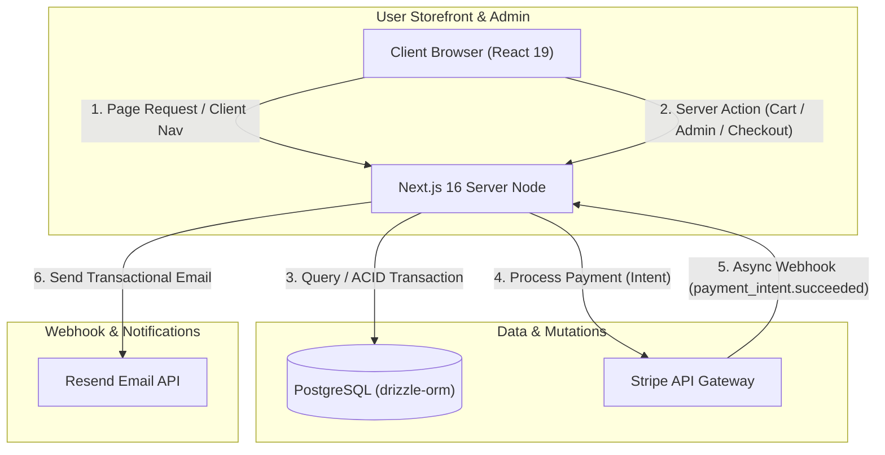
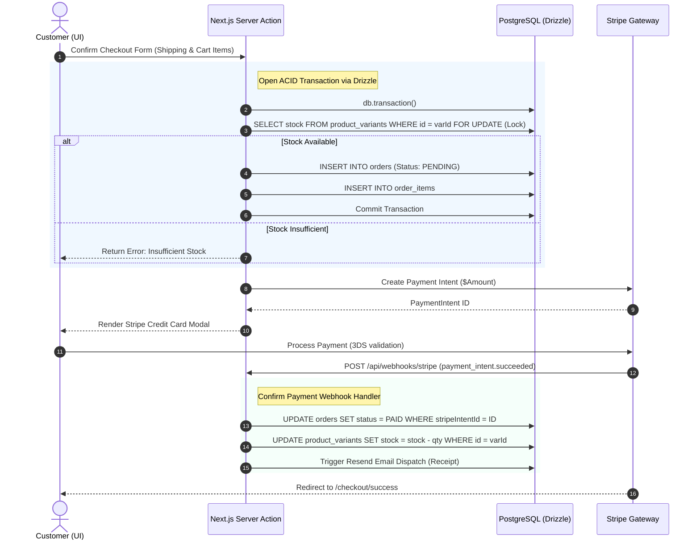

# System Architecture & Design Document: Scents E-Commerce

This document specifies the technical design, database schema, route organization, and critical transactional flows for the **Scents** perfume e-commerce application. The architecture is engineered to use modern web standards, focusing on instant user interaction, robust thread-safe checkout transactions, and seamless integration with third-party APIs.

---

## 1. Technology Stack Overview

### Frontend & Rendering
- **Framework**: Next.js 16 (App Router) utilizing Server Components (RSC) by default for SEO, rapid server rendering, and minimal client bundle sizes.
- **Library**: React 19, incorporating:
  - `useActionState`: For clean state, pending transitions, and error management in form actions.
  - `useOptimistic`: To execute zero-latency UI changes (specifically inside the `Shopping_Cart` component) before network requests complete.
  - `useTransition`: To run mutations in the background while keeping the UI interactive.
- **Styling**: Tailwind CSS v4 featuring the new CSS-first configuration. Theme variables are declared using `@theme` to manage HSL primary/accent mappings, sleek typography (e.g., *Inter* and *Outfit*), and seamless dark-mode utility states.
- **Images**: Next.js `<Image>` for responsive sizing, lazy-loading, WebP/AVIF format conversions, and prevention of Cumulative Layout Shift (CLS).

### Backend & Database
- **Execution Environment**: Node.js and Serverless Edge functions.
- **Database Engine**: PostgreSQL (ACID-compliant relational storage for strong transactional guarantees).
- **ORM**: Drizzle ORM, providing type-safe SQL query generation, simple schema-defined relations, and standard transaction support.
- **Data Validation**: Zod, defining strict schemas for Server Action payloads and API bodies.

### Infrastructure & Services
- **Authentication**: Custom HttpOnly, Secure, SameSite=Lax JWT session cookies, processed in a lightweight Next.js Middleware.
- **Payment Processing**: Stripe API, using Stripe Elements for a customized frontend form and Stripe Webhooks (`/api/webhooks/stripe`) for asynchronous, eventual-consistency order confirmation.
- **Transactional Emails**: Resend API, using JSX-based templates for order confirmations, low-stock warnings, and registration validations.

---

## 2. System Architecture Topology

The following diagram illustrates how the frontend client, Next.js Server Components, Server Actions, PostgreSQL Database, Stripe, and Resend interact:



---

## 3. Database Schema Design (Drizzle ORM)

Below is the database design defined in Drizzle ORM syntax. It structures relationships cleanly and enforces strict constraints (e.g. price precision, unique constraints, and enum bounds).

```typescript
import { 
  pgTable, 
  uuid, 
  varchar, 
  text, 
  decimal, 
  integer, 
  boolean, 
  timestamp, 
  uniqueIndex 
} from 'drizzle-orm/pg-core';
import { relations } from 'drizzle-orm';

// --- ENUMS & USER ROLES ---
export const roleEnum = ['CUSTOMER', 'ADMIN'] as const;
export const orderStatusEnum = ['PENDING', 'PAID', 'SHIPPED', 'CANCELLED', 'REFUNDED'] as const;

// --- USERS TABLE ---
export const users = pgTable('users', {
  id: uuid('id').defaultRandom().primaryKey(),
  email: varchar('email', { length: 255 }).notNull().unique(),
  passwordHash: varchar('password_hash', { length: 255 }).notNull(),
  role: varchar('role', { length: 20, enum: roleEnum }).default('CUSTOMER').notNull(),
  failedAttempts: integer('failed_attempts').default(0).notNull(),
  lockedUntil: timestamp('locked_until'),
  createdAt: timestamp('created_at').defaultNow().notNull(),
  updatedAt: timestamp('updated_at').defaultNow().notNull(),
});

// --- CUSTOMER PROFILES TABLE ---
export const customerProfiles = pgTable('customer_profiles', {
  id: uuid('id').defaultRandom().primaryKey(),
  userId: uuid('user_id').references(() => users.id, { onDelete: 'cascade' }).notNull().unique(),
  name: varchar('name', { length: 100 }),
  shippingAddress: varchar('shipping_address', { length: 500 }),
  phoneNumber: varchar('phone_number', { length: 20 }),
  createdAt: timestamp('created_at').defaultNow().notNull(),
  updatedAt: timestamp('updated_at').defaultNow().notNull(),
});

// --- PRODUCTS TABLE ---
export const products = pgTable('products', {
  id: uuid('id').defaultRandom().primaryKey(),
  name: varchar('name', { length: 255 }).notNull(),
  brand: varchar('brand', { length: 100 }).notNull(),
  description: text('description').notNull(),
  fragranceFamily: varchar('fragrance_family', { length: 50 }).notNull(), // floral, woody, oriental, fresh
  isDiscontinued: boolean('is_discontinued').default(false).notNull(),
  createdAt: timestamp('created_at').defaultNow().notNull(),
  updatedAt: timestamp('updated_at').defaultNow().notNull(),
});

// --- PRODUCT VARIANTS TABLE (For Size Options & Pricing) ---
export const productVariants = pgTable('product_variants', {
  id: uuid('id').defaultRandom().primaryKey(),
  productId: uuid('product_id').references(() => products.id, { onDelete: 'cascade' }).notNull(),
  size: varchar('size', { length: 50 }).notNull(), // e.g. "50ml", "100ml"
  price: decimal('price', { precision: 10, scale: 2 }).notNull(),
  stock: integer('stock').default(0).notNull(),
  sku: varchar('sku', { length: 100 }).notNull().unique(),
});

// --- ORDERS TABLE ---
export const orders = pgTable('orders', {
  id: uuid('id').defaultRandom().primaryKey(),
  orderNumber: varchar('order_number', { length: 50 }).notNull().unique(),
  userId: uuid('user_id').references(() => users.id), // Nullable for guest checkouts
  status: varchar('status', { length: 20, enum: orderStatusEnum }).default('PENDING').notNull(),
  shippingAddress: varchar('shipping_address', { length: 500 }).notNull(),
  email: varchar('email', { length: 255 }).notNull(),
  phone: varchar('phone', { length: 20 }).notNull(),
  totalAmount: decimal('total_amount', { precision: 10, scale: 2 }).notNull(),
  stripePaymentIntentId: varchar('stripe_payment_intent_id', { length: 255 }).unique(),
  createdAt: timestamp('created_at').defaultNow().notNull(),
  updatedAt: timestamp('updated_at').defaultNow().notNull(),
});

// --- ORDER ITEMS TABLE ---
export const orderItems = pgTable('order_items', {
  id: uuid('id').defaultRandom().primaryKey(),
  orderId: uuid('order_id').references(() => orders.id, { onDelete: 'cascade' }).notNull(),
  variantId: uuid('variant_id').references(() => productVariants.id).notNull(),
  quantity: integer('quantity').notNull(),
  priceAtPurchase: decimal('price_at_purchase', { precision: 10, scale: 2 }).notNull(),
});

// --- STOCK THRESHOLDS FOR ALERTS ---
export const stockAlertThresholds = pgTable('stock_alert_thresholds', {
  id: uuid('id').defaultRandom().primaryKey(),
  productId: uuid('product_id').references(() => products.id, { onDelete: 'cascade' }).notNull().unique(),
  threshold: integer('threshold').default(10).notNull(),
  lastAlertSent: timestamp('last_alert_sent'),
});

// --- RELATION DEFINITIONS ---
export const usersRelations = relations(users, ({ one, many }) => ({
  profile: one(customerProfiles),
  orders: many(orders),
}));

export const productsRelations = relations(products, ({ many, one }) => ({
  variants: many(productVariants),
  threshold: one(stockAlertThresholds),
}));

export const productVariantsRelations = relations(productVariants, ({ one, many }) => ({
  product: one(products, { fields: [productVariants.productId], references: [products.id] }),
  orderItems: many(orderItems),
}));
```

---

## 4. Next.js Route Structure (`app` Directory)

Below is the directory map of our Next.js App Router workspace, categorizing the routing architecture, rendering type, and cache configurations:

```
app/
├── globals.css                # Tailwind CSS v4 entry point & theme configuration
├── layout.tsx                 # Root layout with global navigation, footer, & React 19 context
├── middleware.tsx             # Route interceptor (JWT check, role verification, auth redirections)
├── page.tsx                   # Storefront landing. [RSC] [use cache] [unstable_instant]
├── auth/
│   ├── login/
│   │   └── page.tsx           # Customer & Admin login. [Client Component] [useActionState]
│   └── register/
│       └── page.tsx           # Customer sign up. [Client Component] [useActionState]
├── products/
│   ├── page.tsx               # Product Catalog browser. [RSC] [use cache] [unstable_instant]
│   └── [id]/
│       └── page.tsx           # Perfume details. [RSC] [use cache] with dynamic <Suspense> stock checks
├── cart/
│   └── page.tsx               # Shopping Cart Manager. [Client Component] [useOptimistic]
├── checkout/
│   ├── page.tsx               # Checkout form integrating Stripe Elements. [Client Component]
│   └── success/
│       └── page.tsx           # Post-purchase receipt with Order Number summary. [RSC]
├── account/
│   ├── layout.tsx             # Customer account portal side navigation. [Dynamic]
│   └── orders/
│       └── page.tsx           # History of Customer orders. [RSC] [Dynamic]
├── admin/
│   ├── layout.tsx             # Admin sidebar portal. [unstable_instant = false]
│   ├── products/
│   │   └── page.tsx           # Admin product management table. [Dynamic] [Server Actions]
│   ├── orders/
│   │   └── page.tsx           # Admin orders tracking. [Dynamic]
│   └── customers/
│       └── page.tsx           # Admin customer records and GDPR deletion. [Dynamic]
└── api/
    └── webhooks/
        └── stripe/
            └── route.ts       # Secure Stripe webhook listener for payment confirmations
```

---

## 5. Critical Flow Sequence Designs

### Flow A: Instant Navigation & Shell Caching (Next.js 16 Pattern)
Next.js 16 uses the `'use cache'` directive at the component/function level to build highly cached static fragments, while routes export `unstable_instant` to guarantee instantaneous navigations.

```typescript
// app/products/[id]/page.tsx
export const unstable_instant = { prefetch: 'static' };

import { Suspense } from 'react';
import { getProductDetails, getLiveInventory } from './actions';

export default async function ProductDetailPage({ params }: { params: Promise<{ id: string }> }) {
  return (
    <div className="max-w-6xl mx-auto px-4 py-8">
      {/* 1. Cached Product Specifications - Loads instantly under 100ms */}
      <Suspense fallback={<p className="animate-pulse">Loading perfume details...</p>}>
        {params.then(({ id }) => (
          <ProductInfo id={id} />
        ))}
      </Suspense>

      {/* 2. Live Uncached Stock Status - Streams in dynamically afterwards */}
      <Suspense fallback={<p className="text-gray-400">Checking stock levels...</p>}>
        <ProductStock params={params} />
      </Suspense>
    </div>
  );
}

async function ProductInfo({ id }: { id: string }) {
  'use cache'; // Next.js 16 function-level caching directive
  const product = await getProductDetails(id);
  return (
    <div>
      <h1 className="text-4xl font-extrabold text-amber-950">{product.name}</h1>
      <p className="text-lg text-gray-700 mt-2">{product.brand}</p>
      <p className="text-2xl font-bold mt-4">${product.price}</p>
    </div>
  );
}

async function ProductStock({ params }: { params: Promise<{ id: string }> }) {
  const { id } = await params;
  const stock = await getLiveInventory(id); // Dynamic, fresh query from DB
  return (
    <p className="mt-4 text-emerald-600 font-semibold">{stock} units remaining</p>
  );
}
```

---

### Flow B: Secure Payment Processing & Inventory Decrementation (ACID Transactions)
When a purchase is verified, we prevent race conditions (overselling) by wrapping inventory operations in a database-level lock. Eventual consistency of the checkout is driven by Stripe's webhook logic.



---

### Flow C: Session Authentication Middleware
User sessions are secured using stateless JWT cookies, processed on the edge inside `middleware.tsx` to handle customer-specific and admin-dashboard routes efficiently.

```typescript
// middleware.tsx
import { NextResponse } from 'next/server';
import type { NextRequest } from 'next/server';
import { jwtVerify } from 'jose';

export async function middleware(request: NextRequest) {
  const token = request.cookies.get('session_token')?.value;
  const path = request.nextUrl.pathname;

  // 1. Verify access to protected dashboard routes
  if (path.startsWith('/admin')) {
    if (!token) return NextResponse.redirect(new URL('/auth/login', request.url));

    try {
      const { payload } = await jwtVerify(token, new TextEncoder().encode(process.env.JWT_SECRET));
      if (payload.role !== 'ADMIN') {
        // Log unauthorized attempt and redirect
        return NextResponse.redirect(new URL('/', request.url));
      }
    } catch (err) {
      return NextResponse.redirect(new URL('/auth/login', request.url));
    }
  }

  // 2. Verify access to customer accounts
  if (path.startsWith('/account') || path.startsWith('/checkout')) {
    if (!token) return NextResponse.redirect(new URL('/auth/login', request.url));
  }

  return NextResponse.next();
}

export const config = {
  matcher: ['/admin/:path*', '/account/:path*', '/checkout/:path*'],
};
```
